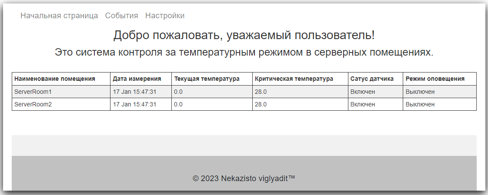

## Temperature control (web)

### Описание

Легковесный проект для наблюдения и контроля за температурным режимом в серверных помещениях.
В данный момент он реально применяется для собственных нужд дежурной смены на моей текущей работе.

#### Поставленные задачи

1. Обеспечить круглосуточный контроль за температурой в двух серверных помещениях.
2. Использовать доступное имеющееся оборудование. Допускается изготовление из подручных материалов.
3. Обеспечить своевременное оповещение при возникновении аварий систем охлаждения серверных помещений.
4. Реализовать наглядный web или gui интерфейс.
5. Логгировать возникающие события, а так же сохранять текущие показатели температуры в базе данных.

#### Оценка имеющихся возможностей, средств

В одном из серверных помещений достаточно корректную температуру только с установленного SNMP-модуля в ИБП. В связи с
отсутствием выбора
было принято решение написать парсер странички веб-интерфейса этого модуля.
В другом помещении корректных и доступных источников для получения температуры не было.
Для оповещения о возникновении аварий был выбран работающий сервер ip-телефонии asterisk. А для логгирования легковесная
база данных Sqlite.

#### Ход выполнения

Идея парсить страницу веб-интерфейса SNMP-модуля провалилась из-за довольно сложной системы аутентификации, которая
полностью строилась на скриптах, а применять,
например, selenium, показалось чрезмерным.
Для решения возникшей проблемы пришлось углубиться в SNMP-протокол, найти на сайте производителя модуля информацию о
OID (конкретный идентификатор, отвечающий за температуру датчика модуля), подобрать библиотеку для работы с snmp. Затем
осталавалось указать номер порта и
найденный OID для формирования запроса, который в ответ присылает актуальное значение температуры.

В серверном помещении без доступных датчиков был установлен микроконтроллер arduino с подключенным к нему, через
делитель напряжения, датчик NTC3950 (NTC термистор).

Arduino подключил к usb-порту сервера, на котором будет работать само приложение. Здесь замысел был в том, что цикл,
описанный в скетче микроконтроллера:

- каждые 10 секунд оправшивает датчик температуры;
- преобразует считанное напряжение с помощью библиотеки NTC в градусы, относительно модели датчика;
- полученное значение передает на COM-порт (на самом деле UART, который так же расположен на плате arduino).

За оповещение в этом проекте отвечает сервер asterisk 16 версии. Для этого был написан кастомный экстеншн для диалплана,
который отправлет вызов на указанный номер телефона и проигрывает указанный аудиофайл (который тоже, в свою очередь был
заранее сгенерирован и помещен в папку для кастомных аудиофайлов на сервере asterisk). Было принято решение использовать
команды через ssh-туннель, чтобы не тратить время на изучение глубин документации asterisk и его api.

Рассматриваемый, в начале разработки проекта, вариант с gui был отброшен из-за неудобства использования и вынужденного
требования
разместить приложение на одном из серверов в серверном помещении без доступных датчиков. В итоге был разработан
простейший
веб-интерфейс с использованием шаблонизатора thymeleaf. Который обеспечивает доступ к актуальной температуре в серверных
помещениях, архиву событий и настройкам приложения.

#### 

#### Результаты

Поставленные задачи достигнуты в полном объеме.
Развернутое приложение позволяет получать по указанному ip-адресу
информацию о датчиках, событиях, изменять настройки.

В автоматическом режиме совершать вызов по указанному телефонному
номеру и проигрывать аудиофайл, логгировать, хранить и выводить на веб-интерфейс происшедшие события (сюда входят ежечасные показатели
температуры, ошибки, предупреждения).
